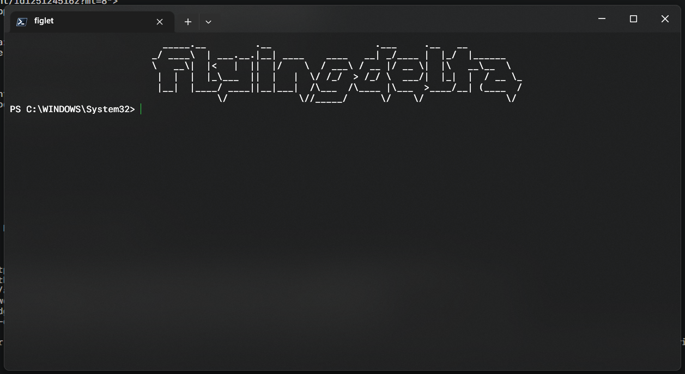

# Customize Windows 💻🖌️✨

Looking to add a personal touch to your Windows 11 machine?

This repository contains a compilation of various tools and scripts that you can use to customize your Windows experience and make it truly your own.

- [Customize Windows 💻🖌️✨](#customize-windows-️)
  - [Startup Text in Windows Terminal 💬](#startup-text-in-windows-terminal-)
    - [Prerequisites](#prerequisites)
    - [Usage](#usage)
  - [Useful PS1 Scripts](#useful-ps1-scripts)
    - [GitHub Repository Downloader and Extractor](#github-repository-downloader-and-extractor)
      - [Description](#description)
      - [Usage](#usage-1)
      - [Parameters](#parameters)
      - [Examples](#examples)

You'll need [Powershell](https://learn.microsoft.com/en-us/powershell/scripting/install/installing-powershell-on-windows?view=powershell-7.3) to execute ps1 scripts

## Startup Text in Windows Terminal 💬



Get awesome ascii art when you start up the terminal

### Prerequisites

Before you dive into the world of Windows customization, there are a few prerequisites that you'll need to have in place

To get started, you'll need to have Node.js installed on your machine. You can download it from the official website [here](https://nodejs.org/).
You'll also need to install figlet-cli globally by running the following command:

```bash
npm install -g figlet-cli
```

Finally, to make things much easier, we highly recommend that you download the Windows Terminal app from the Microsoft Store [here](https://www.microsoft.com/store/productId/9N0DX20HK701).

### Usage

We can edit the PowerShell profile at `$profile` to run some startup commands

1. Make the scripts in [terminal-startup](terminal-startup) available globally:

   - Copy the scripts to some folder
   - Add this folder path to the path system variables
   - Check if it's working by typing the following commands in the terminal

     ```bash
     Write-FormattedText -help

     Write-Figlet -help
     ```

2. If you use windows terminal:
   - Create a new folder for scripts somewhere and create a new file with its name ending with ps1.
   - You can use the commands `Write-Figlet` and `Write-FormattedText` to generate the text you need. An example profile script is given [here](terminal-startup/Example-Profile.ps1)
   - Now, link this ps1 file to a profile in the terminal by editing the Command Line option in the profile settings: `powershell.exe -noprofile -noexit -command "invoke-expression '. ''<Path To The PS1 File>''' "`

## Useful PS1 Scripts

### GitHub Repository Downloader and Extractor

#### Description

This PowerShell script allows you to download a GitHub repository as a zipball archive and extract it to a specified destination folder while excluding specific files and folders.

#### Usage

```powershell
.\Get-Repo.ps1 -githubRepoURL "<GitHubRepoURL>" -branch "<BranchName>" -toExclude @("<FileOrFolder1>", "<FileOrFolder2>") -destinationFolder "<DestinationFolder>"
```

#### Parameters

- `githubRepoURL`

The URL of the GitHub repository to download. It should be in the format `https://github.com/owner/repository`.

- `branch`

The name of the branch to download from the GitHub repository.

- `toExclude`

An array of file/folder names to exclude from the extracted content.

- `destinationFolder`

The folder where the repository will be extracted.

#### Examples

```powershell
# Example 1: Download and extract a GitHub repository, excluding specific files and folders
.\Get-Repo.ps1 -githubRepoURL "https://github.com/example/repo" -branch "main" -toExclude @("config.ini", "docs") -destinationFolder "C:\Projects\MyRepo"

# Example 2: Download and extract another GitHub repository
.\Get-Repo.ps1 -githubRepoURL "https://github.com/chakri68/webpack-babel-template" -branch "with-typescript" -destinationFolder "./webpack-template"
```
